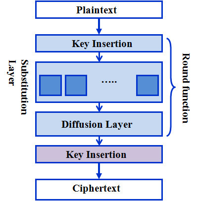

# DISCORD AES,RSA BOT

## 결과물

 </img>
## ChatBot 코드 설명

```js
require("dotenv").config(); // dotenv를 통해 민감한 파일 숨김
const CryptoJS = require("crypto-js"); // 암호 라이브러리
const Discord = require('discord.js');
const client = new Discord.Client();
const prefix = "!"; // !를 기준으로 명령어 받기위해 설정

client.on('ready', () => { //ready신호가 오면 아래글 출력 
  console.log(`Logged in as ${client.user.tag}!`);
});

client.on('message', msg => { //message를 받을때 체크
    if (msg.content.startsWith(prefix)) {
        const args = msg.content.slice(prefix.length).split(" ");
        const command = args.shift().toLowerCase();

        if (command === 'aesenc') { //encrypt
            const encrypted = CryptoJS.AES.encrypt(args.toString(), "1");
            msg.reply(`\n origin : ${args} \n encrypted : ${encrypted}`);

        } else if(command === 'aesdec'){ //decrypt
            const bytes = CryptoJS.AES.decrypt(args.toString(),"1");
            const decrypted = bytes.toString(CryptoJS.enc.Utf8); //인코딩 
            msg.reply(`\n origin : ${args} \n decrypted : ${decrypted}`);
        }
    }
});

client.login(process.env.Token);
```

## AES 설명 
- 고급 암호화 표준(Advanced Encryption Standard) AES 암호 알고리즘은 DES를 대체한 암호 대칭 키 알고리즘 알고리즘이다.
- DES에 비해서 키 사이즈가 자유롭다. 가변 길이의 블록과 가변 길이의 키 사용이 가능하다.(128bit, 192bit, 256bit)
- 속도면에서 효율 적이다.

- SPN 구조 (Substitution Permutation Network) : S,P를 이용해 Confusion과 Diffusion을 만족시켜주는 암호
    - 병렬 연산 가능 (Feistel과는 반대) 
    - 복호화가 역순이 안된다. 

     </img>

- AES의 과정

     </img>


## RSA 설명 
